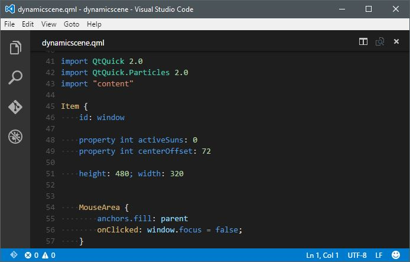

# [QML](http://www.qt.io/) language support for [Visual Studio Code](https://code.visualstudio.com/)

## Features
### Syntax coloring

## Installation
### Visual Studio Code
Hit `F1` and enter the `ext install qml` command.

### Installing the extension Locally
Just clone the [GitHub repository](https://github.com/bbenoist/vscode-qml) under your local extensions folder:
* Windows: `%USERPROFILE%\.vscode\extensions`
* Mac / Linux: `$HOME/.vscode/extensions`

## Issues / Feature requests
You can submit your issues and feature requests on the GitHub [issues page](https://github.com/bbenoist/vscode-qml/issues).

## Contributing
As long as you respect the following rules, I accept any pull-request which can improve the support of the language on Visual Studio Code :
* Indent your code by 2 spaces.
* Document the purpose of functions and classes.
* Document other code where useful.
* When adding a new feature, please mention it in the `README.md` Features section. Use screenshots when applicable.

## More information
* [vscode-qml on the Visual Studio Marketplace](https://marketplace.visualstudio.com/items/bbenoist.qml)
* [vscode-qml GitHub repository](https://github.com/bbenoist/vscode-qml)
* [Visual Studio Code website](http://code.visualstudio.com/)
* [Qt website](http://www.qt.io/)
